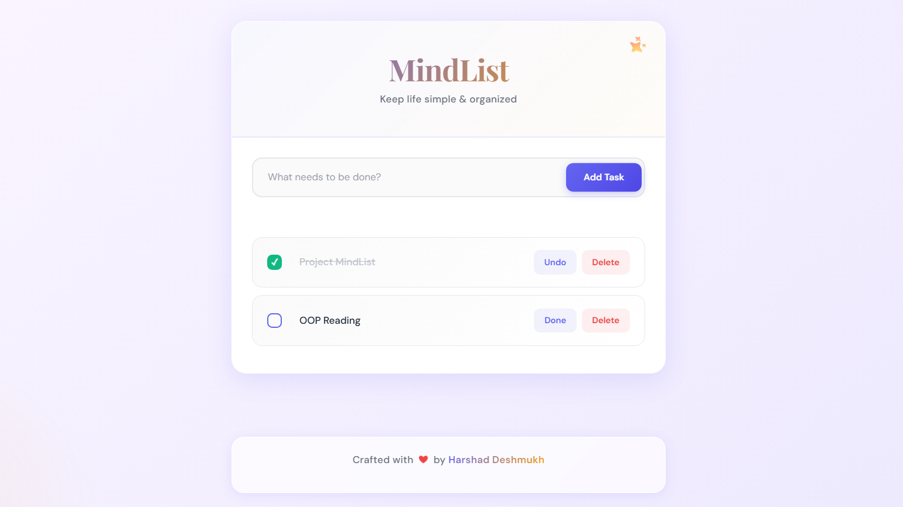

# 🎯 MindList

A beautiful and intuitive todo application built with Spring Boot. Keep your life simple and organized with a modern, gradient-designed interface.

## ✨ Features

- ✏️ **Click-to-Edit** - Click on task titles to edit them inline
- ✅ **Task Management** - Add, edit, complete, and delete tasks
- 🎨 **Beautiful UI** - Modern gradient design with smooth animations
- 📱 **Responsive** - Works perfectly on desktop, tablet, and mobile
- ⌨️ **Keyboard Shortcuts** - Enter to save, ESC to cancel
- 💾 **Persistent Storage** - Tasks saved in H2 database

## 🚀 Installation

```bash
# Clone the repository
git clone https://github.com/harshaadeshmukh/MindList.git
cd MindList

# Build the project
mvn clean install

# Run the application
mvn spring-boot:run
```

Open your browser and go to `http://localhost:8080`

## 🛠️ Tech Stack

**Backend:**
- Spring Boot 3.x
- Spring Data JPA
- Lombok

**Frontend:**
- Thymeleaf
- Bootstrap 5
- CSS3 (Custom animations)


## 🖼️ Preview



## 📌 API Endpoints

| Method | Endpoint | Description |
|--------|----------|-------------|
| GET | `/` | Display all tasks |
| POST | `/` | Create new task |
| POST | `/{id}/update` | Update task title |
| GET | `/{id}/toggle` | Toggle task completion |
| GET | `/{id}/delete` | Delete task |

## 📄 License

This project is licensed under the MIT License.

## 👨‍💻 Author

**Harshad Deshmukh**

- Portfolio: [harshaadeshmukh.netlify.app](https://harshaadeshmukh.netlify.app)
- GitHub: [@harshaadeshmukh](https://github.com/harshaadeshmukh)

---

⭐ Star this repo if you find it helpful!
